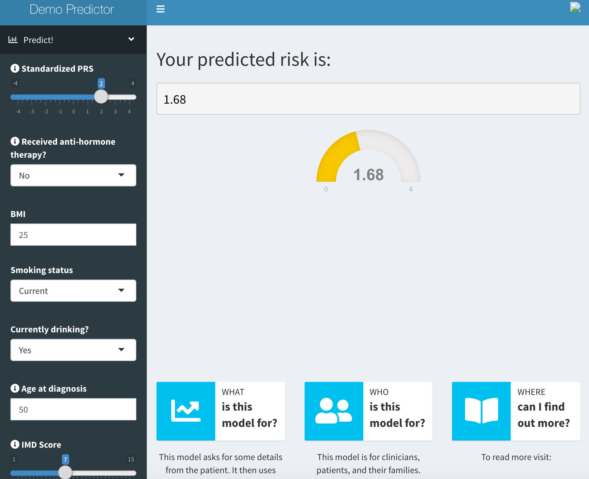

<!-- PROJECT LOGO -->
 

  

  <h3 align="center">Prediction Model Shiny App </h3>

  

    10-year Cardiovascular Risk for Women with Breast Cancer
  

<!-- TABLE OF CONTENTS -->
## Table of Contents

* [About the Project](#about-the-project)
* [Deployment](#deployment)
* [Contributing](#contributing)
* [Contact](#contact)

<!-- ABOUT THE PROJECT -->
## About The Project
This is a Shiny interface intended to demonstrate how to set up a Shiny app prediction model. The dataset this model is built on is a prospective cohort of UK women with breast cancer. The model predicts the relative risk of coronary artery disease compared to an individual who has mean values for each covariate. 

<!-- DEPLOYMENT -->
## Deployment
The app is (currently not yet) deployed through RStudio's webservice shinyapps.io. 

<!-- CONTRIBUTING -->
## Contributing

Contributions are what make the open source community such an amazing place to be learn, inspire, and create. Any contributions you make are **greatly appreciated**.

1. Fork the Project
2. Create your Feature Branch (`git checkout -b feature/AmazingFeature`)
3. Commit your Changes (`git commit -m 'Add some AmazingFeature'`)
4. Push to the Branch (`git push origin feature/AmazingFeature`)
5. Open a Pull Request

<!-- CONTACT -->
## Contact

Email: lathanliu21@gmail.com

Project Link: [https://github.com/latlio/pred_model](https://github.com/latlio/pred_model)